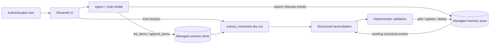

# Databricks managed sessions + memory

A small, workspace-agnostic Python and Streamlit sample showing:

- **Managed sessions:** complete conversation history for one thread.
- **Managed memory:** durable, user-scoped facts and preferences across threads.
- **End-session maintenance:** managed extraction followed by structured semantic reconciliation.

No workspace URL, user ID, or model endpoint is hard-coded. Store defaults are configurable.

## Quickstart

Requirements: Python 3.10+, [uv](https://docs.astral.sh/uv/), the Databricks CLI, an enabled
workspace, and access to a tool-calling chat endpoint.

```bash
uv sync --group dev

databricks auth login \
  --host https://YOUR-WORKSPACE \
  --profile YOUR_PROFILE

export DATABRICKS_CONFIG_PROFILE=YOUR_PROFILE
export DATABRICKS_MODEL=YOUR_CHAT_ENDPOINT

# GPT-5.6-Sol requires this for tool calls; omit it for models that do not.
export DATABRICKS_REASONING_EFFORT=none

# Read-only discovery of identity, models, and stores.
uv run memory-demo doctor

# Run once if the default stores do not exist.
uv run memory-demo init --yes

uv run streamlit run streamlit_app.py
```

`init --yes` may provision billable Lakebase backing. Running the app only opens existing stores.
The defaults are `memory-demo-sessions` and `memory-demo-memory`; override them with
`DEMO_SESSION_STORE` and `DEMO_MEMORY_STORE`.

## Try the UI

1. Share separate preferences, such as “Keep answers concise” and “Use PySpark examples.”
2. Click **End session and capture memory**.
3. Open **Last memory plan** to see each `ADD`, `UPDATE`, `NO_OP`, `DELETE`, or `CONFLICT` decision.
4. Inspect the atomic entries under **User memories**.
5. Start a fresh conversation and ask for a personalized answer.
6. Correct or explicitly forget a preference, end the session, and inspect the resulting update.

The UI gets identity from the configured CLI profile; it never accepts an arbitrary `actor_id`.
To demonstrate isolation, restart it with a profile authenticated as another user.
A managed session is created lazily with the first message, so opening or reconnecting the app does
not create empty records.

## Architecture



Databricks manages the Lakebase-backed session and memory stores. Application code supplies the
authenticated `actor_id` and store names; model-proposed paths are namespace-constrained and
validated before writes.

On each chat turn:

1. `MemoryStore.search` retrieves only relevant canonical memories.
2. The agent answers using the current session plus those results.
3. `Session.append_items` stores the completed turn.

When a session ends:

1. `Session.extract_memories(dry_run=True)` proposes atomic candidates and logical paths.
2. A structured model call compares the transcript, candidates, and current canonical memories.
3. Application validation checks paths, operations, identity scope, and verbatim user evidence.
4. `MemoryStore.add`, `Memory.update`, or `Memory.delete` applies valid decisions.

Canonical entries use stable logical paths such as
`/memories/preferences/communication/verbosity.md`. Session history preserves provenance; memory
holds only the latest consolidated state. Omission never deletes a memory, and ambiguous changes are
left untouched.

## Inspect persisted data

```bash
uv run memory-demo inspect --user-id YOUR_DATABRICKS_USER_ID

uv run memory-demo inspect \
  --user-id YOUR_DATABRICKS_USER_ID \
  --session-id YOUR_SESSION_ID
```

The requested user ID must match the authenticated caller. The first command lists that user's
sessions and memories; the second also returns one complete session transcript.

## Other commands

```bash
# Terminal chat with approved recall/remember/forget tools.
uv run memory-demo --verbose chat

# Isolated managed-storage checks, optionally including model responses.
uv run memory-demo --verbose demo --storage-only --cleanup
uv run memory-demo --verbose demo --cleanup
```

Terminal chat commands are `/new`, `/resume ID`, `/sessions`, `/history`, `/memories`, and `/quit`.
Demo cleanup removes only that run's entries and sessions, never either store or its backing project.

## Test

```bash
uv run pytest
uv run ruff check .
uv run ruff format --check .
uv run pyright
```

Tests cover session replay, user isolation, managed extraction transport, atomic multi-memory plans,
all reconciliation actions, pre-write validation, cross-session recall, and Streamlit session flows.

## Safety

- `actor_id` groups data but is not authorization; derive it from trusted authentication context.
- Retrieved memory and session text is untrusted data and cannot override application instructions.
- Canonical paths are application-scoped and validated before writes.
- Deletion requires explicit user-authored evidence; missing or conflicting information is preserved.
- The sample assumes one memory-maintenance writer per user at a time.
- Managed sessions and memory are Beta APIs and may change.

## References

- [Managed agent memory](https://docs.databricks.com/aws/en/agents/agent-memory/managed-memory)
- [Managed agent sessions](https://docs.databricks.com/aws/en/agents/agent-memory/managed-sessions)
- [Memory: Scaling AI agents](https://www.databricks.com/blog/memory-scaling-ai-agents)
- [Agent API reference](https://docs.databricks.com/api/workspace/)
- [AgentKit SDK](https://github.com/databricks/databricks-ai-bridge/tree/main/integrations/agentbricks)
